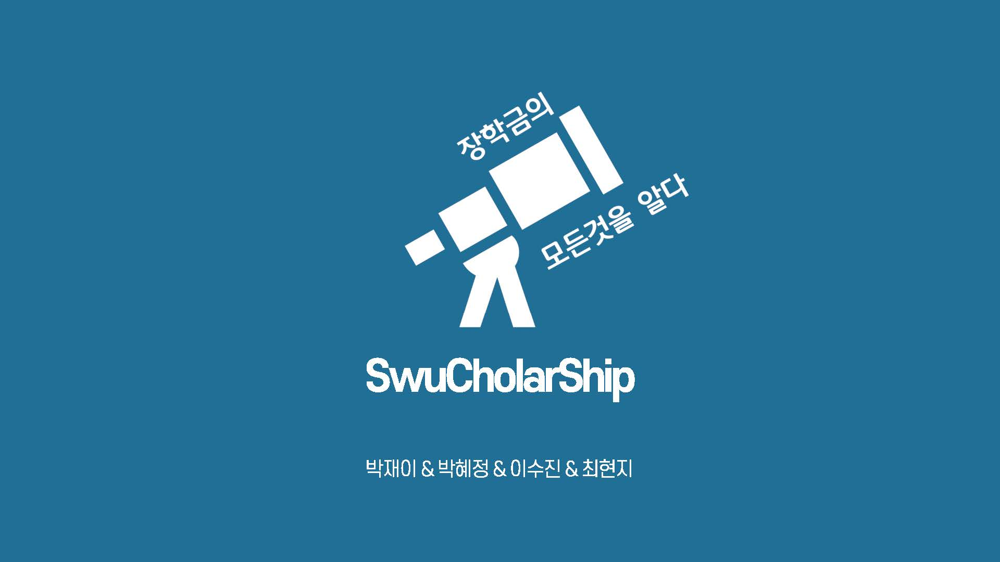
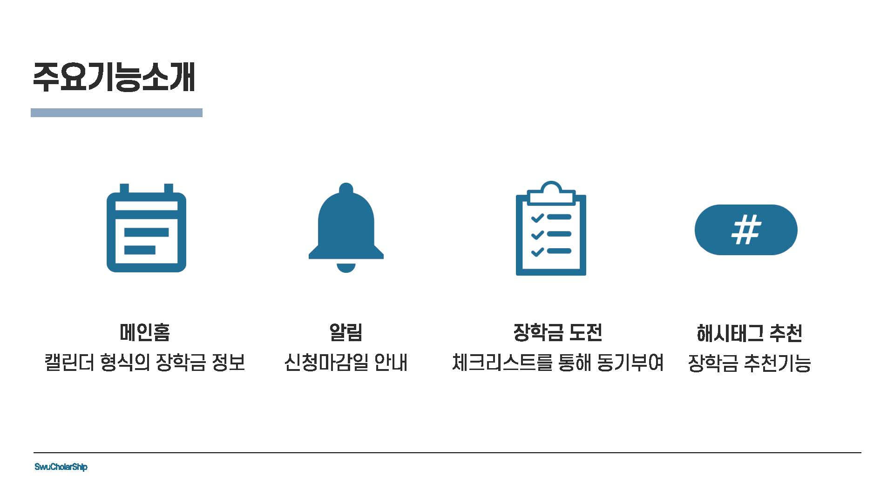
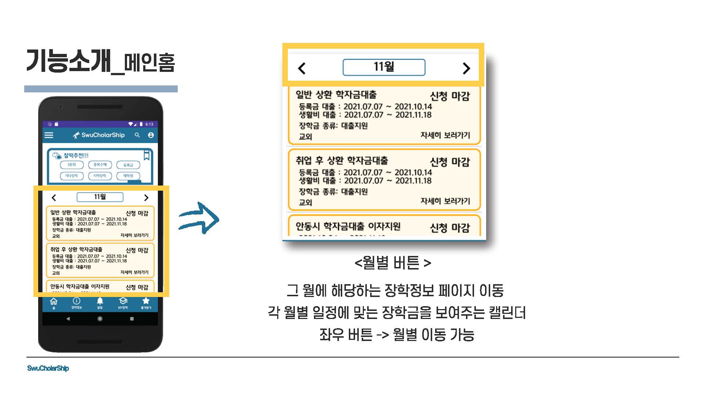
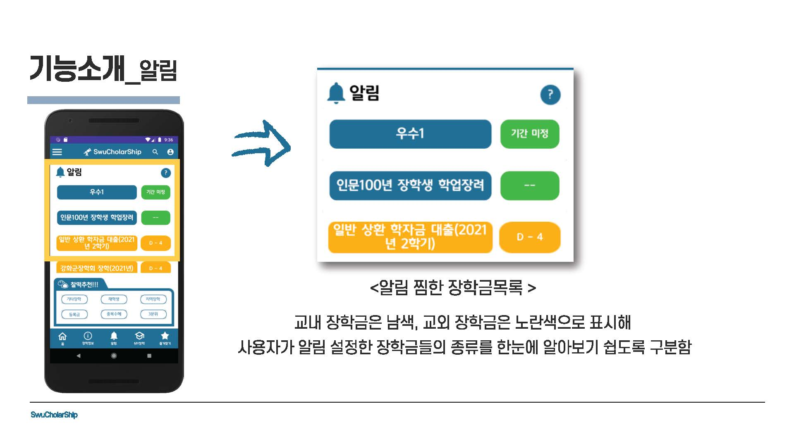
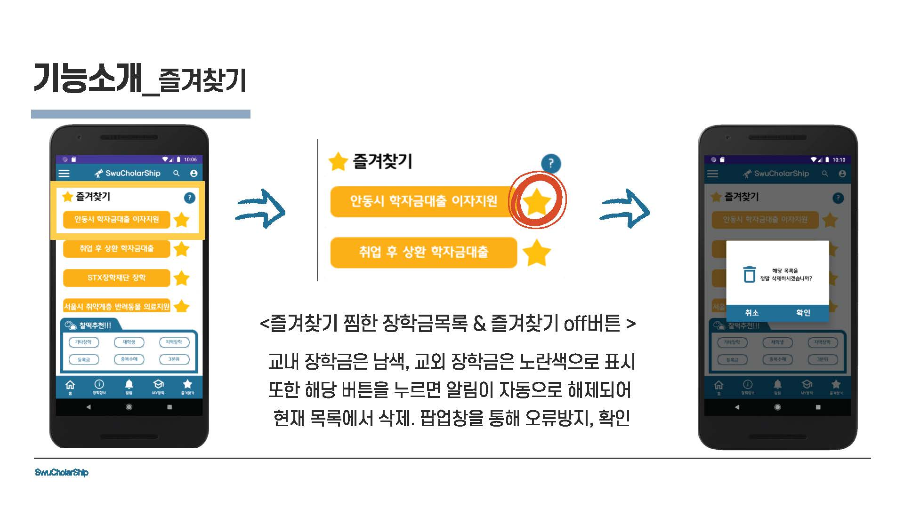
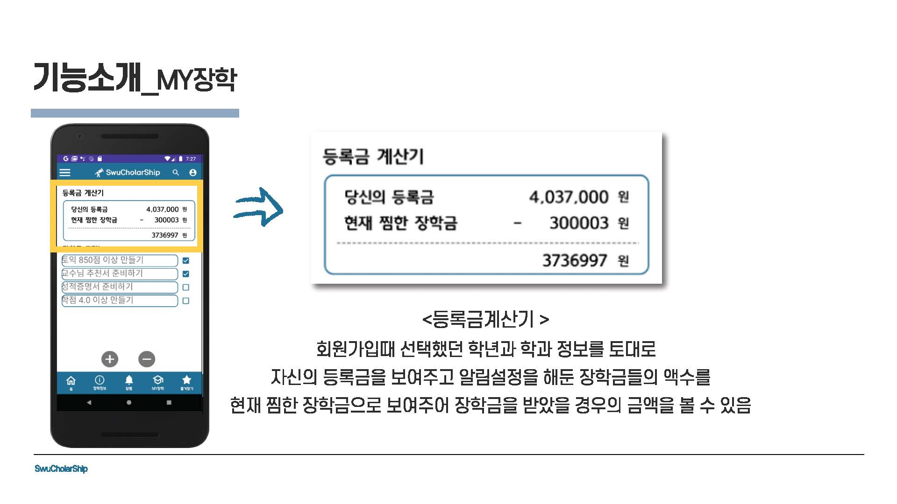
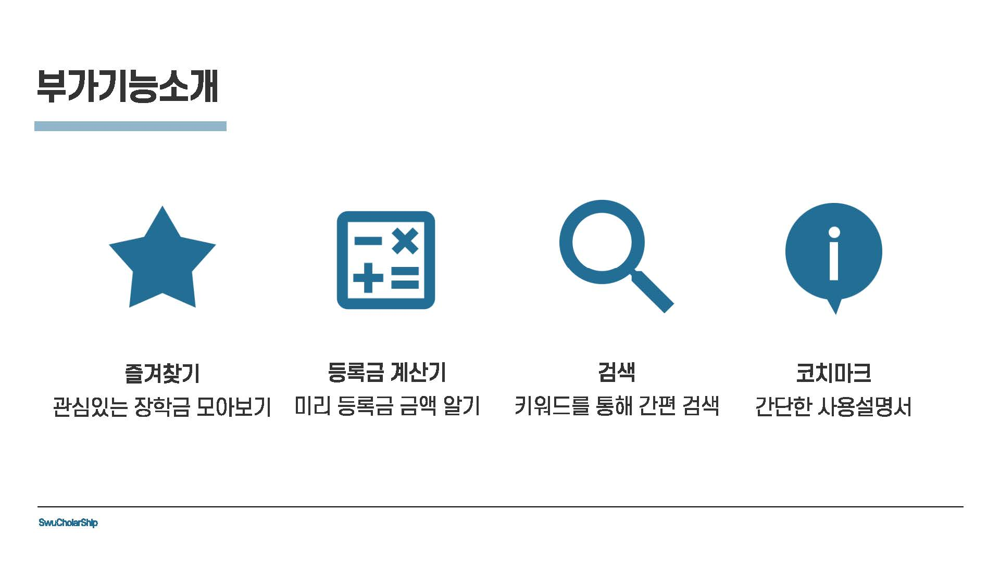

# SwuCholarShip

<div align="center">
  
  
  **장학금의 모든것을 알다**
</div>

서울여자대학교 학생들이 개발한 장학금 정보 관리 Android 애플리케이션입니다. 학생들이 장학금 신청 기회를 놓치지 않도록 돕는 것이 목표입니다.

## 프로젝트 소개

SwuCholarShip은 대학생들을 위한 혁신적인 장학금 정보 중앙화 애플리케이션입니다. 학생들이 개별적으로 검색하지 않고도 장학금 정보를 쉽게 찾고 공유할 수 있도록 하여, 장학금 신청 마감일을 놓치지 않도록 돕습니다.

> **우리의 미션**: *"서울여자대학교 학생들뿐만 아니라 많은 대학생들이 일일이 정보를 찾지 않고도 정보를 공유하는 것이 목적으로 놓치지 않고 장학금을 신청할 수 있도록 도움이 되는 앱이 되길 바라며..."*

## 해결하고자 하는 문제

<div align="center">
  
</div>

- **정보 분산**: 수많은 장학금이 존재하지만 정보를 찾기 어려움
- **기회 상실**: 인지 부족으로 인한 장학금 신청 기회 놓침
- **시간 소모**: 각 장학금마다 개별적으로 조사하는 시간 소요
- **중앙화된 플랫폼 부재**: 모든 장학금 정보를 관리할 수 있는 단일 플랫폼 부재

**우리의 해결책**: 숨겨져 있는 장학금을 한눈에 보여주고 놓치지 않고 신청할 수 있도록 동기부여하는 중앙화된 플랫폼

## 주요 기능

<div align="center">
  
</div>

### 🏠 메인홈
<div align="center">
  
</div>
- **캘린더 형식**: 직관적인 캘린더 형식으로 장학금 정보 표시
- **스마트 추천**: 해시태그 필터링을 통한 개인화된 장학금 추천
- **빠른 접근**: 장학금 카테고리 간 쉬운 탐색

### 🔔 알림 시스템
<div align="center">
  
</div>
- **마감일 추적**: 카운트다운 타이머가 포함된 신청 마감일 알림
- **시각적 표시**: 색상 코딩된 알림 (초록: 안전, 노랑: 주의, 빨강: 긴급)
- **자동 정렬**: 우선순위 관리가 쉬운 긴급도별 알림 정렬

### ⭐ 즐겨찾기
<div align="center">
  
</div>
- **북마크 시스템**: 관심 있는 장학금을 쉽게 접근할 수 있도록 저장
- **색상 코딩**: 교내 장학금(남색), 교외 장학금(노란색)
- **빠른 관리**: 확인 대화상자와 함께 쉬운 추가/제거

### 🧮 등록금 계산기
<div align="center">
  
</div>
- **스마트 계산**: 장학금을 뺀 나머지 등록금 자동 계산
- **프로필 통합**: 등록된 학과 및 학년 정보 활용
- **실시간 업데이트**: 현재 즐겨찾기한 장학금 금액 표시

## 부가 기능

<div align="center">
  
</div>

### 🔍 검색
- **키워드 검색**: 빠르고 쉬운 장학금 검색 기능
- **고급 필터**: 정확한 결과를 위한 여러 검색 기준

### 📖 코치마크
- **사용자 가이드**: 대화형 튜토리얼이 포함된 간단한 사용 설명서
- **기능 발견**: 사용자가 앱 기능을 이해할 수 있도록 도움

## 앱 사용 흐름

### 로그인 및 회원가입
<div align="center">
  
</div>

### 전체적인 사용 흐름
<div align="center">
  
</div>

## 기술적 세부사항

### 아키텍처
- **언어**: Kotlin
- **UI 프레임워크**: Material Design을 활용한 Android 네이티브
- **아키텍처 패턴**: ViewPager2를 활용한 Fragment 기반 네비게이션

### 주요 구성요소
- **메인 액티비티**: `ToolActivity` - 네비게이션 및 Fragment 관리
- **Fragment**: 
  - 하단 네비게이션 Fragment (Home, Info, Alarm, MyPage, Star)
  - 드로어 네비게이션 Fragment (Inside, Outside, Nation)
- **네비게이션**: DrawerLayout + BottomNavigationView + ViewPager2

### 의존성
- **AndroidX 라이브러리**: Core, AppCompat, Material Design, ConstraintLayout
- **Fragment 지원**: 향상된 Fragment 처리를 위한 Fragment-ktx
- **네비게이션**: Material Design 네비게이션 컴포넌트

## 프로젝트 구조

```
app/
├── src/main/
│   ├── java/com/example/swucholars_imclude_bttombar02/
│   │   ├── ToolActivity.kt                    # 메인 액티비티
│   │   ├── Adapter/
│   │   │   └── DrawerFragmentStatePagerAdapter.kt
│   │   ├── fragment_bottombar/               # 하단 네비게이션 Fragment
│   │   │   ├── HomeFragment.kt
│   │   │   ├── InfoFragment.kt
│   │   │   ├── AlarmFragment.kt
│   │   │   ├── MypageFragment.kt
│   │   │   └── StarFragment.kt
│   │   └── fragment_drawer/                  # 드로어 네비게이션 Fragment
│   │       ├── InsideFragment.kt
│   │       ├── OutsideFragment.kt
│   │       └── NationFragment.kt
│   ├── res/
│   │   ├── layout/                           # UI 레이아웃
│   │   ├── menu/                             # 네비게이션 메뉴
│   │   ├── drawable/                         # 아이콘 및 이미지
│   │   └── values/                           # 문자열, 색상, 테마
│   └── AndroidManifest.xml
└── build.gradle
```

## 설치 및 설정

### 필수 조건
- Android Studio Arctic Fox 이상
- Android SDK API level 30
- 최소 SDK 버전 24 (Android 7.0)

### 빌드 방법
1. 저장소 클론
2. Android Studio에서 프로젝트 열기
3. Gradle 파일과 프로젝트 동기화
4. 애플리케이션 빌드 및 실행

### Gradle 설정
```gradle
android {
    compileSdkVersion 30
    buildToolsVersion "30.0.0"
    
    defaultConfig {
        applicationId 'com.example.swucholars_imclude_bttombar02'
        minSdkVersion 24
        targetSdkVersion 30
        versionCode 1
        versionName "1.0"
    }
}
```

## 개발 정보

- 단일 액티비티 아키텍처와 여러 Fragment 사용
- 부드러운 Fragment 전환을 위한 ViewPager2 사용
- UI 전체에 Material Design 컴포넌트 사용
- 일관된 브랜딩을 위한 사용자 정의 폰트 (WeMakePrice) 적용

## 버전 정보

- **버전**: 1.0
- **빌드**: 릴리스 빌드 구성 사용 가능
- **타겟 SDK**: Android API 30
- **최소 SDK**: Android API 24

## 기대효과

<div align="center">
  
</div>

## 개발팀

<div align="center">

**박재이 & 박혜정 & 이수진 & 최현지**

*개발팀 멤버*

</div>

## 인용 및 사용 안내

**인용**: 연구나 학술 작업에서 이 프로젝트를 사용하실 경우, 이 저장소를 인용하고 원저자들을 인정해 주세요.

### 학술적 사용
학술 또는 연구 목적으로 사용하실 경우:
- 원저자들을 인정해 주세요
- 참조로 사용하실 경우 이 저장소를 인용해 주세요
- 협업 기회를 위해 개발팀에 연락해 주세요

### 라이선스 안내
이 프로젝트는 서울여자대학교 학생들이 개발한 프로젝트입니다. 지적재산권을 존중하고 책임감 있게 사용해 주세요.
